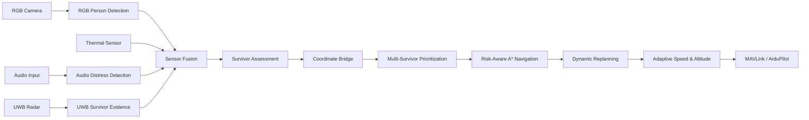
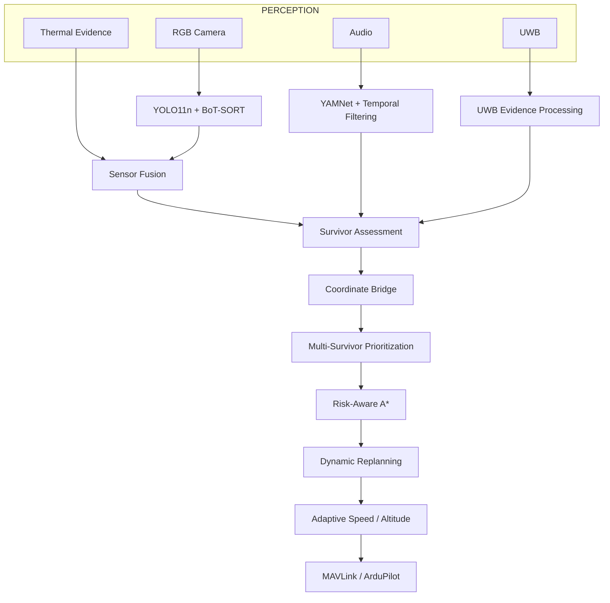

# GARUDA — Autonomous Disaster Reconnaissance & Survivor Search


GARUDA is a smart autonomous disaster-reconnaissance and survivor-search system designed for post-earthquake and urban search-and-rescue scenarios.

The system combines RGB vision, thermal evidence, acoustic distress cues, UWB sensing, survivor assessment, multi-survivor prioritization, risk-aware navigation, dynamic replanning, and adaptive flight control into a unified decision pipeline.


## System Overview

GARUDA follows the pipeline:

**Sense → Detect → Fuse → Assess → Prioritize → Navigate → Replan → Adapt → Command**



---

## Key Features

### 1. RGB Person Detection and Tracking

* YOLO11n-based person detection
* BoT-SORT tracking
* Persistent tracking IDs
* Detection tuned for sensitivity to small, distant and partially occluded people
* Configured prototype parameters:

  * Confidence threshold: `0.3`
  * Image size: `960`
  * Person class filtering

### 2. RGB + Thermal Sensor Fusion

The system combines RGB detections with thermal evidence to improve survivor confirmation.

The fusion stage considers:

* RGB detection confidence
* Thermal confidence
* Sensor reliability
* Timestamp alignment
* Dominant sensor evidence

The current thermal input is **synthetically generated for software testing**.

**Status:** `SIMULATED / SOFTWARE PROTOTYPE`

No physical thermal camera has been integrated or validated in the current repository.

### 3. Audio Distress Detection

GARUDA uses YAMNet-based acoustic event classification to identify distress-related acoustic cues such as:

* Screaming
* Shouting
* Yelling
* Whimpering

Temporal filtering is applied so that a single noisy prediction does not immediately trigger a distress cue.

Persistent distress detections generate an:

`AUDIO_DISTRESS_CUE`

This acts as **supporting evidence** for survivor assessment rather than definitive survivor detection.

**Status:** `IMPLEMENTED / TESTED WITH WAV AUDIO`

---

### 4. UWB Survivor Evidence

The UWB module processes survivor-related radar evidence including:

* Human confidence
* Range
* Angle
* Micro-motion confidence
* Breathing confidence
* Signal quality
* Concealed-target indication

The module combines these signals into a survivor confidence value and identifies potential concealed survivors.

The current UWB input is **software-generated test/simulated data**.

**Status:** `IMPLEMENTED IN SOFTWARE / SIMULATED INPUT`

No physical UWB radar hardware is connected in the current prototype.

---

### 5. Survivor Assessment

Evidence from multiple sensing channels is converted into a structured survivor assessment.

Possible assessment categories include:

* `CONCEALED_SURVIVOR`
* `POSSIBLE_SURVIVOR`
* `AUDIO_CUE_ONLY`
* `UNCONFIRMED`

The assessment combines evidence such as:

* RGB person detection
* Thermal evidence
* Audio distress cues
* UWB human activity
* Breathing evidence
* Micro-motion evidence


---

### 6. Coordinate Bridge

UWB relative-position information is converted into the navigation coordinate system.

The coordinate bridge accounts for:

* Relative UWB position
* Drone grid position
* Drone heading
* Grid resolution

---

### 7. Multi-Survivor Prioritization

When multiple potential survivors are detected, GARUDA ranks them based on factors including:

* Survivor condition
* Detection confidence
* Accessibility
* Hazard level
* Distance

The highest-priority survivor becomes the current navigation target.

---

### 8. Risk-Aware Navigation

GARUDA uses an A* based navigation system operating on a disaster-environment risk map.

The navigation layer considers:

* Obstacles
* Debris
* Environmental risk
* Fire
* Flood-related risk
* Movement cost

The path planner attempts to find a route that balances distance and risk instead of blindly selecting the shortest geometric path.

**Status:** `IMPLEMENTED / SIMULATED ENVIRONMENT`

---

### 9. Dynamic Replanning

The navigation system can update its route when the environment changes.

Prototype tests simulate a new hazard appearing on the current route.

The system then:

1. Detects the route conflict
2. Updates the risk map
3. Recalculates the path
4. Produces an alternative route

**Status:** `IMPLEMENTED IN SIMULATION`


---

### 10. Adaptive Flight Control

The flight-control layer adapts drone speed and altitude according to the current situation.

Inputs include:

* Survivor assessment confidence
* Obstacle/risk level
* Battery percentage
* Current speed
* Current altitude

Example behaviour:

| Situation               | Response                       |
| ----------------------- | ------------------------------ |
| Low survivor confidence | Faster search                  |
| Moderate confidence     | Slow detailed search           |
| High confidence         | Very slow investigation        |
| Very high confidence    | Hover and investigate          |
| High obstacle risk      | Stop / avoid                   |
| Low battery             | Limit speed / return behaviour |

The basic adaptive flight-control logic was provided as a starting module by a team member and was **integrated into the GARUDA perception, assessment, navigation, and autonomous-response pipeline**.

**Status:** `IMPLEMENTED IN SOFTWARE`

---

## Flood and Disaster-Risk Modelling

Flood-related environmental risk is represented through the navigation risk map.

The navigation layer can evaluate routes through areas with different environmental risk levels and select safer alternatives.

**Current status:**

* Flood risk representation: **Implemented**
* Risk-aware path planning: **Implemented**
* Dynamic route adaptation: **Implemented in simulation**
* Physical flood sensor: **Not implemented**
* Live flood perception: **Not implemented**

---

# Implementation Status

GARUDA is a hybrid prototype consisting of implemented software components and simulated/test interfaces.

| Component                          | Status                                  |
| ---------------------------------- | --------------------------------------- |
| RGB person detection               | **IMPLEMENTED**                         |
| BoT-SORT tracking                  | **IMPLEMENTED**                         |
| RGB perception output              | **IMPLEMENTED**                         |
| Thermal fusion logic               | **IMPLEMENTED / SIMULATED THERMAL**     |
| Audio distress classification      | **IMPLEMENTED / WAV TESTED**            |
| Temporal audio filtering           | **IMPLEMENTED**                         |
| UWB processing logic               | **IMPLEMENTED / SIMULATED INPUT**       |
| UWB relative positioning           | **IMPLEMENTED / TEST INPUT**            |
| Survivor assessment                | **IMPLEMENTED**                         |
| Coordinate bridge                  | **IMPLEMENTED**                         |
| Multi-survivor prioritization      | **IMPLEMENTED**                         |
| Risk-map navigation                | **IMPLEMENTED / SIMULATED ENVIRONMENT** |
| A* path planning                   | **IMPLEMENTED**                         |
| Dynamic replanning                 | **IMPLEMENTED / SIMULATED HAZARDS**     |
| Adaptive speed control             | **IMPLEMENTED / SOFTWARE TEST**         |
| Adaptive altitude control          | **IMPLEMENTED / SOFTWARE TEST**         |
| Flood risk modelling               | **IMPLEMENTED IN RISK MAP**             |
| MAVLink physical command execution | **IMPLEMENTED**                         |

---


# Architecture



---

# End-to-End Prototype Pipeline

The main integration entry point is:

```text
ai/full_live_pipeline.py
```

The prototype pipeline follows:

```text
RGB Input
   ↓
YOLO11n + BoT-SORT
   ↓
RGB Detection
   ↓
Thermal Evidence
   ↓
RGB + Thermal Fusion
   ↓
Audio Distress Evidence
   ↓
UWB Survivor Evidence
   ↓
Survivor Assessment
   ↓
Coordinate Transformation
   ↓
Multi-Survivor Prioritization
   ↓
Risk-Aware Navigation
   ↓
Dynamic Replanning
   ↓
Adaptive Speed / Altitude
   ↓
MAVLink / ArduPilot Integration
```

The current end-to-end prototype uses a mixture of real/test inputs and simulated components. This is intentional so that the software architecture can be validated before physical sensor and flight-controller integration.

---

# Current Prototype Inputs

### Real / Test Inputs

* RGB video/image input
* WAV audio recordings
* YOLO11n pretrained weights

### Simulated / Software Inputs

* Thermal sensor data
* UWB radar observations
* Drone position and heading
* Battery state
* Current flight state
* Environmental hazard changes

---

# Technologies

### AI / Perception

* Python
* YOLO11
* BoT-SORT
* TensorFlow
* TensorFlow Hub
* YAMNet

### Navigation

* A*
* Risk-aware path planning
* Grid-based environment modelling
* Dynamic replanning

### Drone / Integration

* MAVLink
* ArduPilot
* Python telemetry interfaces
* Software-based flight-control logic

---


# Limitations

The current repository represents a software-focused prototype.

Important limitations include:

1. Thermal sensing is currently simulated.
2. UWB sensing uses simulated/test observations.
3. Audio detection has been tested using WAV recordings rather than an onboard microphone.
4. Navigation hazards are represented through simulated/environmental risk maps.
5. No LiDAR is currently integrated.
6. The adaptive flight controller has been validated through software inputs rather than physical flight.
7. No physical drone flight validation has been performed in this repository.

---

# Future Work

* Integrate physical thermal camera
* Integrate physical UWB radar
* Integrate onboard microphone array
* Add real-time hazard perception
* Improve survivor confidence calibration
* Fine-tune the RGB detector for disaster environments
* Validate the complete pipeline on a physical UAV
* Add robust communication-loss and telemetry-freshness handling

---

# Project Goal

GARUDA aims to demonstrate how multiple imperfect sensing modalities can be combined into a decision-making pipeline for disaster reconnaissance.

Instead of treating a single detection as ground truth, the system attempts to:

**Detect → Cross-check → Assess → Prioritize → Navigate → Replan → Adapt**

The ultimate goal is to assist search-and-rescue operations by allowing an autonomous drone to identify promising survivor locations and safely prioritize its investigation.

