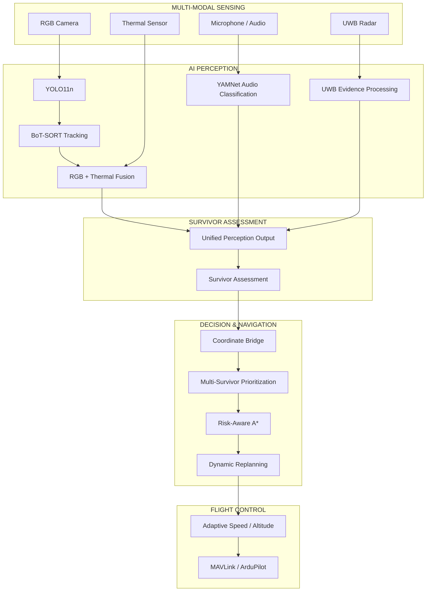

# GARUDA Architecture

## High-Level Architecture



---

## Implementation Classification

### IMPLEMENTED

Software components currently implemented and tested include:

* YOLO11n person detection
* BoT-SORT tracking
* Perception output generation
* RGB + thermal fusion logic
* YAMNet audio classification
* Temporal audio distress filtering
* UWB evidence processing
* Survivor assessment
* Coordinate transformation
* Multi-survivor prioritization
* Risk-aware A* navigation
* Dynamic replanning
* Adaptive speed control
* Adaptive altitude control
* Flood/environmental risk-map modelling

### SIMULATED / TEST INPUT

The following currently use simulated or test inputs:

* Thermal observations
* UWB observations
* Drone pose
* Drone heading
* Battery state
* Current flight state
* Environmental hazard changes

### FUTURE PHYSICAL INTEGRATION

* Physical thermal camera
* Physical UWB radar
* Onboard microphone hardware
* Physical UAV
* Live MAVLink telemetry
* ArduPilot command execution
* Live hazard sensors
* Physical flight validation

---

## Integration Philosophy

GARUDA is designed as a modular pipeline rather than a single monolithic AI model.

Each stage produces structured information for the next stage:

```text
Sensor Evidence
      ↓
Perception
      ↓
Evidence Fusion
      ↓
Survivor Assessment
      ↓
Coordinate Mapping
      ↓
Target Prioritization
      ↓
Risk-Aware Navigation
      ↓
Dynamic Replanning
      ↓
Adaptive Flight Control
      ↓
Flight Controller
```

This allows individual modules to be tested independently while still supporting end-to-end integration.

---

## Contribution Boundary

The project is collaborative.

The AI/system-integration contribution includes connecting perception, sensor evidence, survivor assessment, navigation and flight-control modules into a unified pipeline.

Where a module originated from another team member, the repository treats its integration and adaptation separately from its original algorithmic implementation.

This distinction is maintained to accurately represent team contributions.
